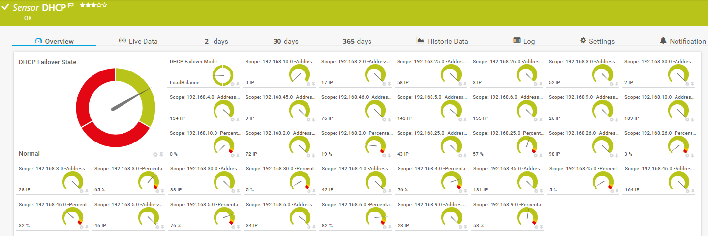

# PRTG-DHCP-Stats
# About

## Project Owner:

Jannos-443

## Project Details

- Monitors DHCP Scopes (PercentageInUse, AddressesFree, AddressesInUse and ReservedAddresses)
- Monitors DHCP Failover State and Mode

## HOW TO

1. Place "PRTG-DHCP-Stats.ps1" under "C:\Program Files (x86)\PRTG Network Monitor\Custom Sensors\EXEXML"

2. Place the lookup File "dhcp.failover.mode.ovl" "dhcp.failover.state.ovl" under (C:\Program Files (x86)\PRTG Network Monitor\lookups\custom)

3. Run PRTG Lookup File Reload

4. create a "EXE/Script Advanced" sensor. Choose this script from the dropdown and set at least:
    + Parameters: -DHCPServer %host or -DHCPServer DHCP-Server
    + Security Context: Use Windows credentials of parent device

4. Set the "$IgnorePattern" or "$IgnoreScript" parameter to Exclude DHCP Scopes if needed

5. Set additionally parameter if needed.
   - "-PercentageInUse" (default = enabled)
     Shows the percentage of used IP Adresses per scope. 
   
   - "-CheckFailOver"
   Shows DHCP Failover State and Mode. 

   - "-AddressesFree"
    Shows the Free Addresses per scope. 

   - "-AddressesInUse"
    Shows the Addresses in Use per scope. 

   - "-ReservedAddress"
    Shows the Reserved Addresses per scope.


## Examples


DHCP Scope exceptions
------------------
You can either use the **parameter $IgnorePattern** to exclude a DHCP Scope on sensor basis, or set the **variable $IgnoreScript** within the script. Both variables take a regular expression as input to provide maximum flexibility. These regexes are then evaluated againt the **DHCP Scope ID**

By default, the $IgnoreScript varialbe looks like this:

```powershell
$IgnoreScript = '^(TestIgnore)$'
```

For more information about regular expressions in PowerShell, visit [Microsoft Docs](https://docs.microsoft.com/en-us/powershell/module/microsoft.powershell.core/about/about_regular_expressions).

".+" is one or more charakters
".*" is zero or more charakters
