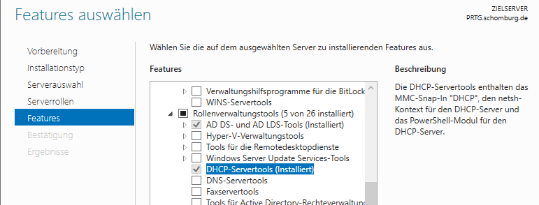
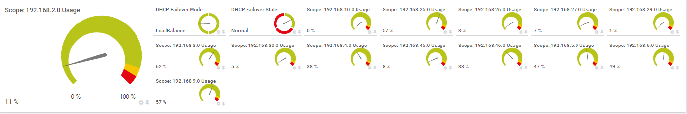
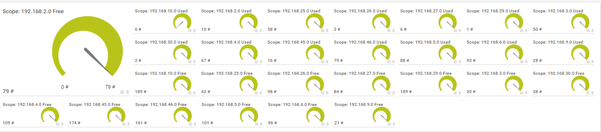

# PRTG-DHCP-Stats.PS1

<!-- ABOUT THE PROJECT -->
### About The Project
Project Owner: Jannos-443

PRTG Script to monitor Windows DHCP

Free and open source: [MIT License](https://github.com/Jannos-443/PRTG-DHCP-Stats/blob/main/LICENSE)

**Features**
* PercentageInUse
* CheckFailOver
* AddressesFree
* AddressesInUse
* ReservedAddress
* IPv4 and IPv6 Scopes
* Excludes/Includes


<!-- GETTING STARTED -->
## Getting Started

1. Place `PRTG-DHCP-Stats.ps1` under `C:\Program Files (x86)\PRTG Network Monitor\Custom Sensors\EXEXML`

2. Place the lookup File `dhcp.failover.mode.ovl` `dhcp.failover.state.ovl` under `C:\Program Files (x86)\PRTG Network Monitor\lookups\custom`

3. Run PRTG Lookup File Reload

4. Install `DHCP-Servertools` on the PRTG Probe (DHCP Powershell Module)

   

5. create a "EXE/Script Advanced" sensor. Choose this script from the dropdown and set at least:
    + Parameters: -DHCPServer %host or -DHCPServer "YourDHCPServer"
    + Security Context: Use Windows credentials of parent device
    + User needs "DHCP Users" AD Permission!
    + 

6. Set the **$ExcludeScope** or **$IncludeScope** parameter to Exclude/Include DHCP Scopes if needed

## Examples
```powershell
-DHCPServer "YourDHCPServer" -CheckFailOver -PercentageInUse
```
Display Failover and PercentageInUse channels


```powershell
-DHCPServer "YourDHCPServer" -AddressesFree -AddressesInUse
```
Display AddressesFree and AddressesInUse channels



DHCP Scope exceptions
------------------
You can either use the **parameter $ExcludeScope** to exclude a DHCP Scope on sensor basis, or set the **variable $ExcludeScript** within the script. Both variables take a regular expression as input to provide maximum flexibility. These regexes are then evaluated againt the **DHCP Scope ID**

By default, the $ExcludeScript varialbe looks like this:

```powershell
$ExcludeScript = '^(TestIgnore)$'
```

For more information about regular expressions in PowerShell, visit [Microsoft Docs](https://docs.microsoft.com/en-us/powershell/module/microsoft.powershell.core/about/about_regular_expressions).

".+" is one or more charakters
".*" is zero or more charakters
